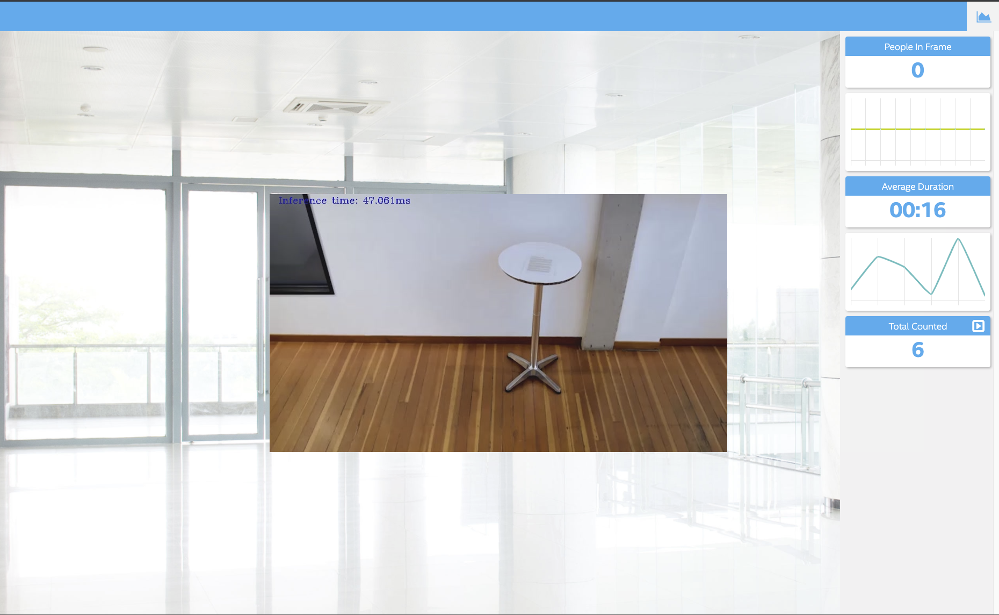
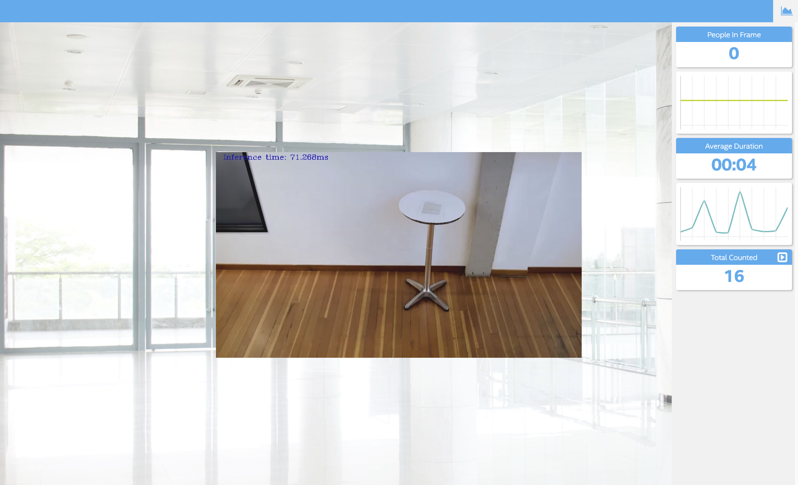
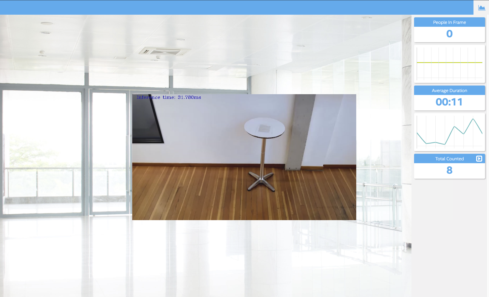
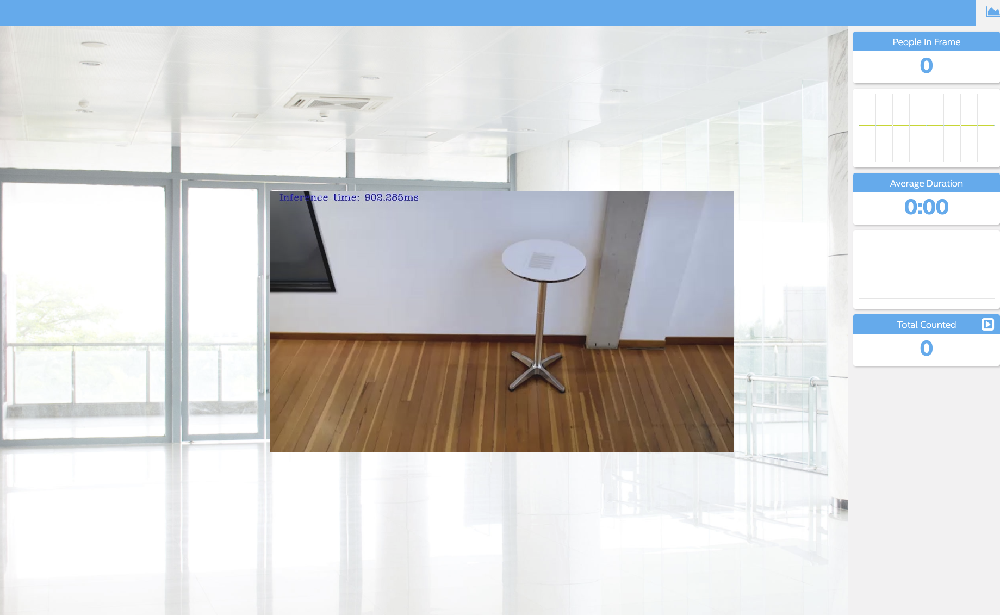

# People Counter App 

Tested in Udacitys workspace environment, I also tested in OSX and Ubuntu.

## Explaining Custom Layers

OpenVINO toolkit supports neural network model layers in multiple frameworks including TensorFlow, Caffe, MXNet, Kaldi and ONYX. The list of known layers is different for each of the supported frameworks. To see the layers supported by your framework, refer to [supported frameworks](https://docs.openvinotoolkit.org/2019_R3.1/_docs_MO_DG_prepare_model_Supported_Frameworks_Layers.html).

Custom layers are layers that are not included in the list of known layers. If your topology contains any layers that are not in the list of known layers, the Model Optimizer classifies them as custom.

The Model Optimizer searchs the list of known lyaers for eatch layer contained in the input model before producing the Intermidiate Representation files.

 If a device doesn't support a particular layer, an alternative to creating a new custom layer is to target an additional device using the HETERO plugin. The Heterogeneous Plugin may be used to run an inference model on multiple devices allowing the unsupported layers on one device to "fallback" to run on another device (e.g., CPU) that does support those layers.

## Comparing Model Performance

My method(s) to compare models before and after conversion to Intermediate Representations
were compareing tensorflow script(comparemodel.ipnb) and OpenVino script with single frame from video file. For this comparison I used *ssdlite_mobilenet_v2* model.

The difference between model accuracy pre- and post-conversion was...

 - Pre : 0.67874008
 - Post : 0.5501172

The size of the model pre- and post-conversion was...

 - Pre : 20Mb
 - Post : 18Mb

The inference time of the model pre- and post-conversion was...

 - Pre : 311.874 ms
 - Post : 57.693 ms

## Assess Model Use Cases

Some of the potential use cases of the people counter app are 

 - Retail store customers analytics application to track customers move, number and duration to stop to make better strategy.

 - Factory safe monitering application, if workers are enter the hazard area, beep sound adnd send warning to manager.

## Assess Effects on End User Needs

Lighting, model accuracy, and camera focal length/image size have different effects on a
deployed edge model. 

In COCO model(common ojbects in context) includes lots of different angle, lighting, camera, focal length, image size, number, activity, body shpae, size of people images. 
but if people with new costume or camera angle is not common may decrease the accuracy. if COCO model is not enough to end users needs need to add more images and train model to achieve specific use problem. 

## Run

### Step 1 - Start the Mosca server

cd webservice/server/node-server
node ./server.js

### Step 2 - Start the GUI

cd webservice/ui
npm run dev

### Step 3 - FFmpeg Server

sudo ffmpeg/ffserver -f ./ffmpeg/server.conf

### Step 4 - Run the code

source /opt/intel/openvino/bin/setupvars.sh -pyver 3.5

### with video file
 - with person-detection-retail-0013 model
        Inference time : 47 ms
        Total Count : 6
        Average Duration : 16

        python main.py -i resources/Pedestrian_Detect_2_1_1.mp4 -m ./intel/person-detection-retail-0013/FP32/person-detection-retail-0013.xml  -l /opt/intel/openvino/deployment_tools/inference_engine/lib/intel64/libcpu_extension_sse4.so -d CPU -pt 0.6 | ffmpeg -v warning -f rawvideo -pixel_format bgr24 -video_size 768x432 -framerate 24 -i - http://0.0.0.0:3004/fac.ffm

- with SSD MobileNet V2 COCO model
      Inference time : 72 ms
      Total Count : 8
      Average Duration : 00:12

      python main.py -i resources/Pedestrian_Detect_2_1_1.mp4 -m public/ssd_mobilenet_v2_coco/ssd_mobilenet_v2_coco_2018_03_29/frozen_inference_graph.xml -l /opt/intel/openvino/deployment_tools/inference_engine/lib/intel64/libcpu_extension_sse4.so -d CPU -pt 0.3 | ffmpeg -v warning -f rawvideo -pixel_format bgr24 -video_size 768x432 -framerate 24 -i - http://0.0.0.0:3004/fac.ffm

- with SSD Lite MobileNet V2 COCO model
      Inference time : 31 ms
      Total Count : 8
      Average Duration : 00:11

      python main.py -i resources/Pedestrian_Detect_2_1_1.mp4 -m public/ssdlite_mobilenet_v2/ssdlite_mobilenet_v2_coco_2018_05_09/frozen_inference_graph.xml -l /opt/intel/openvino/deployment_tools/inference_engine/lib/intel64/libcpu_extension_sse4.so -d CPU -pt 0.3 | ffmpeg -v warning -f rawvideo -pixel_format bgr24 -video_size 768x432 -framerate 24 -i - http://0.0.0.0:3004/fac.ffm

 - with SSD 300 Model
      Inference time : 894 ms
      Total Count : 0
      Average Duration : 0

        python main.py -i resources/Pedestrian_Detect_2_1_1.mp4 -m public/ssd300/models/VGGNet/VOC0712Plus/SSD_300x300_ft/VGG_VOC0712Plus_SSD_300x300_ft_iter_160000.xml -l /opt/intel/openvino/deployment_tools/inference_engine/lib/intel64/libcpu_extension_sse4.so -d CPU -pt 0.2 | ffmpeg -v warning -f rawvideo -pixel_format bgr24 -video_size 768x432 -framerate 24 -i - http://0.0.0.0:3004/fac.ffm

### with webcam

        python main.py -i CAM -m models/faster_rcnn_inception_v2_coco_2018_01_28/frozen_inference_graph.xml -l /opt/intel/openvino/deployment_tools/inference_engine/lib/intel64/libcpu_extension_sse4.so -d CPU -pt 0.6 | ffmpeg -v warning -f rawvideo -pixel_format bgr24 -video_size 768x432 -framerate 24 -i - http://0.0.0.0:3004/fac.ffm

## Model Research

Looked “Tensorflow Detection Model Zoo”, which is a collection of pre-trained models compatible with Tensorflow Object Detection API.

https://docs.openvinotoolkit.org/2019_R3/_docs_MO_DG_prepare_model_convert_model_Convert_Model_From_TensorFlow.html

In investigating potential people counter models, I tried each of the following three models:

- Model 1: [SSD 300]

        cd /opt/intel/openvino/deployment_tools/tools/model_downloader

        ./downloader.py --name ssd300 -o /home/workspace/

        python /opt/intel/openvino/deployment_tools/model_optimizer/mo.py \
          --input_model VGG_VOC0712Plus_SSD_300x300_ft_iter_160000.caffemodel \
          --input_proto deploy.prototxt

  - Genarated IR model, **VGG_VOC0712Plus_SSD_300x300_ft_iter_160000.xml** and **VGG_VOC0712Plus_SSD_300x300_ft_iter_160000.bin** in **/home/workspace/public/ssd300/models/VGGNet/VOC0712Plus/SSD_300x300_ft** directory
  
- Model 2: [SSD MobileNet V2 coco]
  - download with openvino downloader

        cd /opt/intel/openvino/deployment_tools/tools/model_downloader

        ./downloader.py --name ssd_mobilenet_v2_coco -o /home/workspace/

  - I converted the model to an Intermediate Representation with the following arguments.

        cd /home/workspace/public/ssd_mobilenet_v2_coco/ssd_mobilenet_v2_coco_2018_03_29

        python /opt/intel/openvino/deployment_tools/model_optimizer/mo.py \
        --input_model frozen_inference_graph.pb \
        --reverse_input_channels \
        --tensorflow_object_detection_api_pipeline_config pipeline.config \
        --tensorflow_use_custom_operations_config /opt/intel/openvino/deployment_tools/model_optimizer/extensions/front/tf/ssd_v2_support.json

  - Generated IR model **frozen_inference_graph.xml** and **frozen_inference_graph.bin** in /**public/ssd_mobilenet_v2_coco/ssd_mobilenet_v2_coco_2018_03_29/**

- Model 3: [SSD Lite MobileNet V2 COCO]
  - download with openvino downloader

        cd /opt/intel/openvino/deployment_tools/tools/model_downloader

        ./downloader.py --name ssdlite_mobilenet_v2 -o /home/workspace/

  - I converted the model to an Intermediate Representation with the following arguments.

        cd /home/workspace/public/ssdlite_mobilenet_v2/ssdlite_mobilenet_v2_coco_2018_05_09

        python /opt/intel/openvino/deployment_tools/model_optimizer/mo.py \
        --input_model frozen_inference_graph.pb \
        --reverse_input_channels \
        --tensorflow_object_detection_api_pipeline_config pipeline.config \
        --tensorflow_use_custom_operations_config /opt/intel/openvino/deployment_tools/model_optimizer/extensions/front/tf/ssd_v2_support.json

  - Generated IR model **frozen_inference_graph.xml** and **frozen_inference_graph.bin** in /**public/ssdlite_mobilenet_v2/ssdlite_mobilenet_v2_coco_2018_05_0/**

